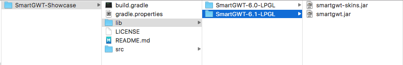

# SmartGWT-Showcase
## A Gradle build for Isomorphics' SmartGWT LPGL Showcase

*https://github.com/will-gilbert/SmartGWT-Showcase*

You need to download two Jar files, ```smartgwt-skins.jar``` and ```smartgwt.jar``` into the ```lib/SmartGWT-X.X-LPGL``` directory of this project, where ```X.X``` is the version number of the release, *e.g.* 6.1 as shown below.



These LGPL licensed SmartGWT library files can be downloaded from the **Isomophics.com** website at :

*http://www.smartclient.com/product/download.jsp*

The target browser(s) can be set using the ```gradle.properties``` file by setting the comma delimited ```user.agent``` property.


```
#  Build for the following browsers:
#
#     safari : Apple Safari, Google Chrome, WebKit broswers
#   gecko1_8 : FireFox
#        ie6 : Windows IE6 and IE7
#        ie8 : Windows IE8
#        ie9 : Windows IE9
#      opera : Opera
#     iphone : iPhone
#

user.agent=safari,gecko1_8

```